# Web Application Document - Projeto Individual - Módulo 2 - Inteli

## Nome do Projeto

#### Autor do projeto

## Sumário

1. [Introdução](#c1)  
2. [Visão Geral da Aplicação Web](#c2)  
3. [Projeto Técnico da Aplicação Web](#c3)  
4. [Desenvolvimento da Aplicação Web](#c4)  
5. [Referências](#c5)  

<br>

## <a name="c1"></a>1. Introdução (Semana 01)

Esse sistema será uma plataforma para a criação de eventos de forma a simplificar a organização e gestão deles, oferecendo soluções completas para o gerenciamento de inscrições e divulgação da programação do evento. Com um sistema intuitivo, os organizadores podem gerenciar facilmente desde a criação do evento até o acompanhamento de participantes.


## <a name="c2"></a>2. Visão Geral da Aplicação Web

### 2.1. Personas (Semana 01)

<div align="center">
  <sub>FIGURA 1 - Amélia</sub><br>
  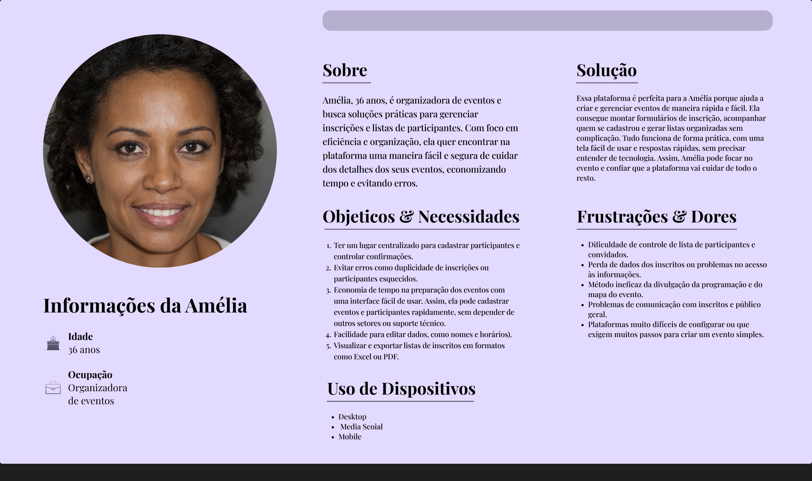<br>
  <sup>Fonte: Material produzido pelos autores, 2025</sup>
  </div>

### 2.2. User Stories (Semana 01)

\# | Story | I | N | V | E | S | T |
---| --- | --- | --- | --- | --- | --- | --- 
US01 | Como organizador de eventos, quero ter um controle centralizado das informações dos participantes, para que eu possa acompanhar confirmações, gerenciar mudanças de forma simples. | O controle centralizado das informações dos participantes pode ser desenvolvido e implementado sem depender de outras funcionalidades. Pode ser priorizada e entregue de forma autônoma. | A user story é negociável, pois a maneira de implementar o controle centralizado das informações pode ser discutida. Os detalhes de como o gerenciamento das confirmações e mudanças será feito podem ser ajustados com base nas necessidades do time ou do cliente. | A funcionalidade é valiosa para o organizador de eventos, pois facilita o processo de monitoramento e gestão das confirmações de participação e alterações nas informações dos participantes, ajudando a otimizar o fluxo de trabalho e garantir que o organizador tenha visibilidade total e controle sobre as informações de forma eficiente.| O escopo pode ser estimado considerando a quantidade de participantes, tipos de informações que precisam ser controladas e os requisitos técnicos para a implementação do controle centralizado. | Essa user story é pequena o suficiente para ser concluída dentro de um ciclo de desenvolvimento de uma sprint. | A user story é testável, pois podemos definir critérios de aceitação claros para garantir que a funcionalidade atenda aos requisitos. A validação pode ser feita por testes manuais ou automatizados para garantir que as mudanças e confirmações sejam gerenciadas de forma eficaz. 
US02 | Como participante, posso efetuar a inscrição no evento para consumir conteúdo.  | 
US03 | Como UX designer, eu quero fazer uma interface intuitiva para facilitar a navegabilidade do usuário. | 

---

## <a name="c3"></a>3. Projeto da Aplicação Web

### 3.1. Modelagem do banco de dados  (Semana 3)

<div align="center">
  <sub>FIGURA 2 - Modelo Lógico</sub><br>
  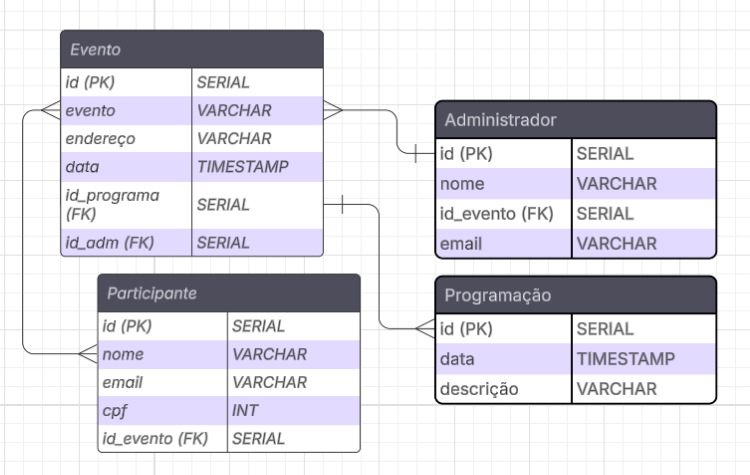<br>
  <sup>Fonte: Material produzido pelos autores, 2025</sup>
  </div>

*Modelo Físico*

```
CREATE TABLE IF NOT EXISTS evento (
id SERIAL PRIMARY KEY,
evento VARCHAR(150),
endereço VARCHAR(300),
data TIMESTAMP,
FOREIGN KEY (id_programa) REFERENCES programação(id),
FOREIGN KEY (id_adm) REFERENCES administrador(id),
FOREIGN KEY (id_participante) REFERENCES participante(id)
);
CREATE TABLE IF NOT EXISTS administrador(
id SERIAL PRIMARY KEY,
nome VARCHAR(100),
FOREIGN KEY (id_evento) REFERENCES evento(id),
email VARCHAR(300)
);
CREATE TABLE IF NOT EXISTS participante (
id SERIAL PRIMARY KEY,
nome VARCHAR(100),
email VARCHAR(300),
cpf INT,
FOREIGN KEY (id_evento) REFERENCES evento(id)
);
CREATE TABLE IF NOT EXISTS programação (
id SERIAL PRIMARY KEY,
data TIMESTAMP,
descrição VARCHAR(500),
FOREIGN KEY (id_evento) REFERENCES evento(id)
);

```
[Schema](../assets/bd.sql)


### 3.1.1 BD e Models (Semana 5)
<div align="center">
  <sub>FIGURA 3 - Diagrama MVC</sub><br>
  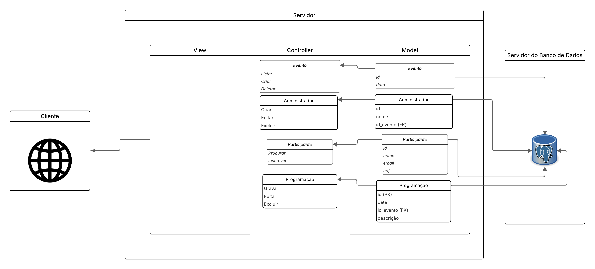<br>
  <sup>Fonte: Material produzido pelos autores, 2025</sup>
  </div>

### 3.2. Arquitetura (Semana 5)

*Posicione aqui o diagrama de arquitetura da sua solução de aplicação web. Atualize sempre que necessário.*

**Instruções para criação do diagrama de arquitetura**  
- **Model**: A camada que lida com a lógica de negócios e interage com o banco de dados.
- **View**: A camada responsável pela interface de usuário.
- **Controller**: A camada que recebe as requisições, processa as ações e atualiza o modelo e a visualização.
  
*Adicione as setas e explicações sobre como os dados fluem entre o Model, Controller e View.*

### 3.3. Wireframes (Semana 03)

<div align="center">
  <sub>FIGURA 4 - Tela 1</sub><br>
  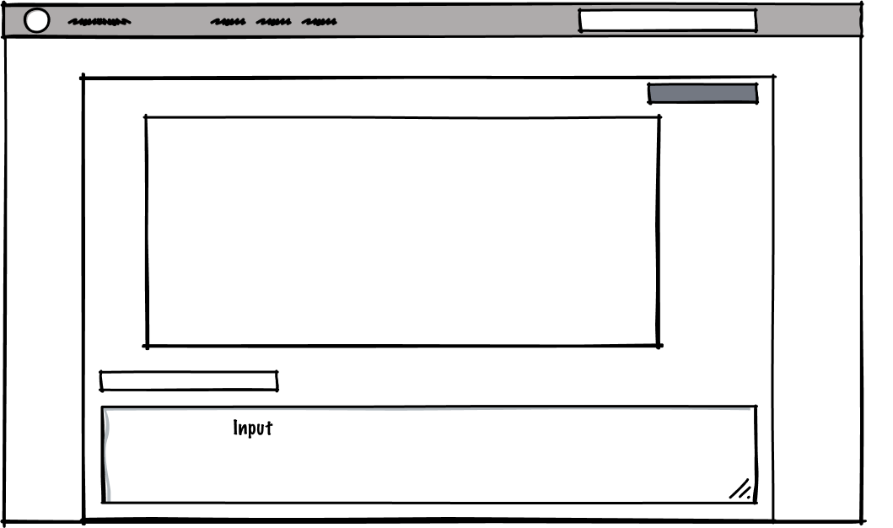<br>
  <sup>Fonte: Material produzido pelos autores, 2025</sup>
  </div>

<div align="center">
  <sub>FIGURA 5 - Tela 2</sub><br>
  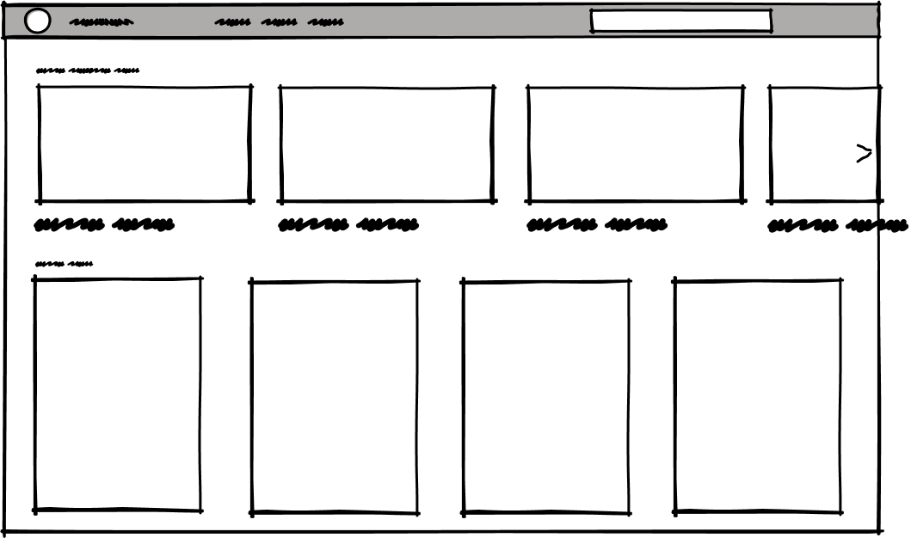<br>
  <sup>Fonte: Material produzido pelos autores, 2025</sup>
  </div>

  <div align="center">
  <sub>FIGURA 6 - Tela 3</sub><br>
  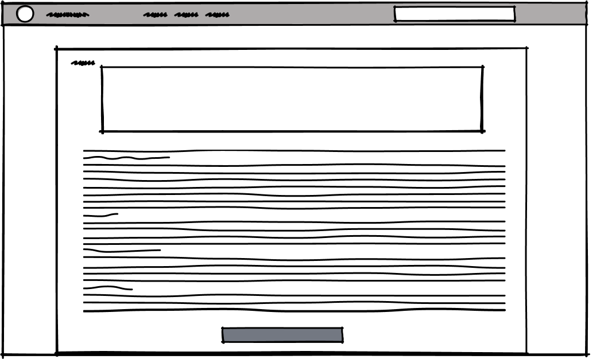<br>
  <sup>Fonte: Material produzido pelos autores, 2025</sup>
  </div>

Os três wireframes representam diferentes etapas da interação do usuário com um sistema de gerenciamento de eventos. O primeiro wireframe corresponde à tela de criação de evento. Nessa interface, o usuário pode cadastrar um novo evento preenchendo campos com informações relevantes. Há uma grande área de texto destinada à inserção das descrições principais do evento (a programação, local, etc). Logo abaixo, existe um campo menor que serve para o título do evento, e um campo adicional que pode ser utilizado para inserir informações complementares. No canto superior direito da área de texto, há um botão de ação para “Salvar” ou “Publicar” – que finaliza o processo de criação do evento.

O segundo wireframe refere-se à tela de visualização geral dos eventos disponíveis. Trata-se de uma interface com um layout em grade, que exibe uma série de eventos ao usuário. No topo da tela há uma barra de navegação que contém o nome da aplicação e um campo de busca. A parte superior da grade destaca os eventos mais novos, enquanto a parte inferior apresenta outros eventos cadastrados. Cada item é representado com uma imagem ou ícone e pequenas descrições. Uma seta no canto direito indica que o usuário pode navegar lateralmente para acessar mais eventos.

O terceiro wireframe mostra a tela de visualização detalhada de um evento. Esta interface é acessada quando o usuário seleciona um dos eventos listados anteriormente. No topo há um campo destacado, com o nome do evento, seguido de uma grande área de texto com os detalhes completos, como descrição, agenda, local, informações sobre os organizadores, entre outros. Ao final da página há um botão para realizar a inscrição no evento. Essa tela serve como o ponto final do fluxo, onde o usuário decide participar efetivamente do evento após conhecer todos os detalhes.


### 3.4. Guia de estilos (Semana 05)


<div align="center">
  <sub>FIGURA 7 - Cores</sub><br>
  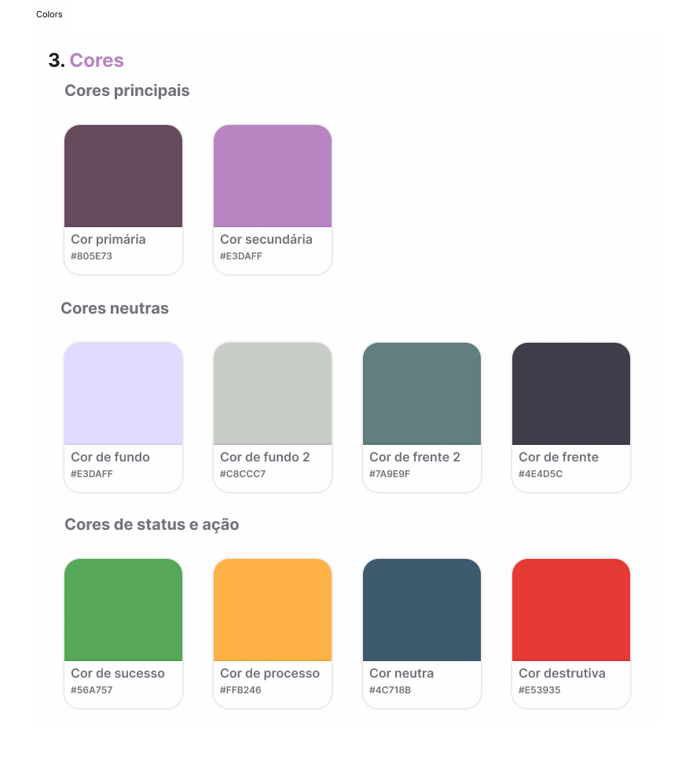<br>
  <sup>Fonte: Material produzido pelos autores, 2025</sup>
  </div>

O sistema de cores é dividido em três categorias:

Cores principais: utilizadas para reforçar a identidade visual (Primária e Secundária). Essas cores são ideais para botões de destaque, cabeçalhos ou links importantes.

Cores neutras: aplicadas em fundos e textos para manter um layout equilibrado e limpo. Por exemplo, o fundo principal, e cores de frente são para textos de alta legibilidade.

Cores de status e ação: indicam estados do sistema. Por exemplo, a cor de sucesso para confirmações, cor de processo (#FFB246) para algo em andamento, cor destrutiva para ações como deletar, e cor neutra para opções secundárias.

<div align="center">
  <sub>FIGURA 8 - Tipografia</sub><br>
  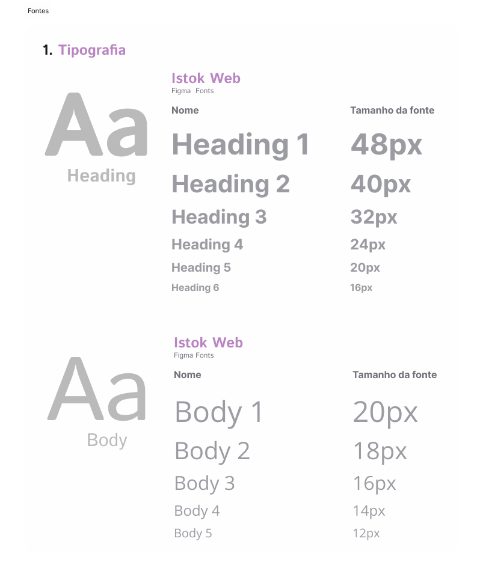<br>
  <sup>Fonte: Material produzido pelos autores, 2025</sup>
  </div>

  A tipografia é baseada na fonte Istok Web, disponível no Figma Fonts. Os títulos (headings) vão de Heading 1 (48px) a Heading 6 (16px), e os corpos de texto (body) variam de 20px a 12px, conforme sua hierarquia e importância. Os tamanhos maiores são para dar destaque e guiar a leitura do usuário, e os menores para textos auxiliares.

  <div align="center">
  <sub>FIGURA 9 - Ícones</sub><br>
  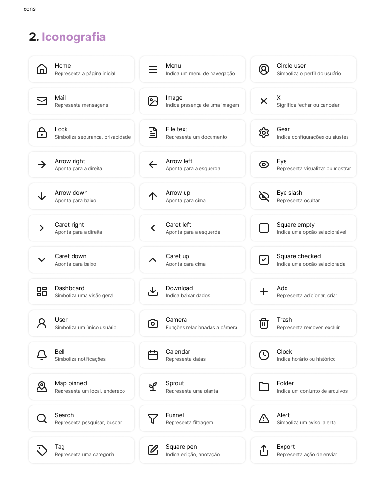<br>
  <sup>Fonte: Material produzido pelos autores, 2025</sup>
  </div>

  Os ícones utilizados representam ações ou elementos recorrentes na interface e serão aplicados conforme sua função semântica. Por exemplo, o ícone Home deve indicar a página inicial, enquanto o Trash simboliza a ação de excluir.

### 3.5. Protótipo de alta fidelidade (Semana 05)

  <div align="center">
  <sub>FIGURA 10 - Listagem dos Eventos</sub><br>
  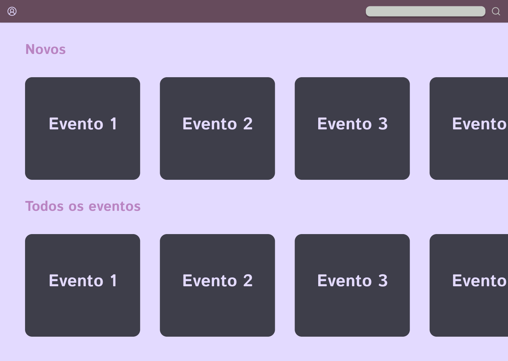<br>
  <sup>Fonte: Material produzido pelos autores, 2025</sup>
  </div>
  Essa tela corresponde à visualização de um evento específico. Nela, o usuário pode consultar os principais dados de um evento previamente cadastrado, como o título, a data e hora de início e conclusão, além da descrição detalhada do que ocorrerá. O botão “Inscrever-se” posicionado na parte inferior direita, permitindo que o usuário confirme seu interesse e participação no evento.

  <div align="center">
  <sub>FIGURA 11 - Criar um Evento</sub><br>
  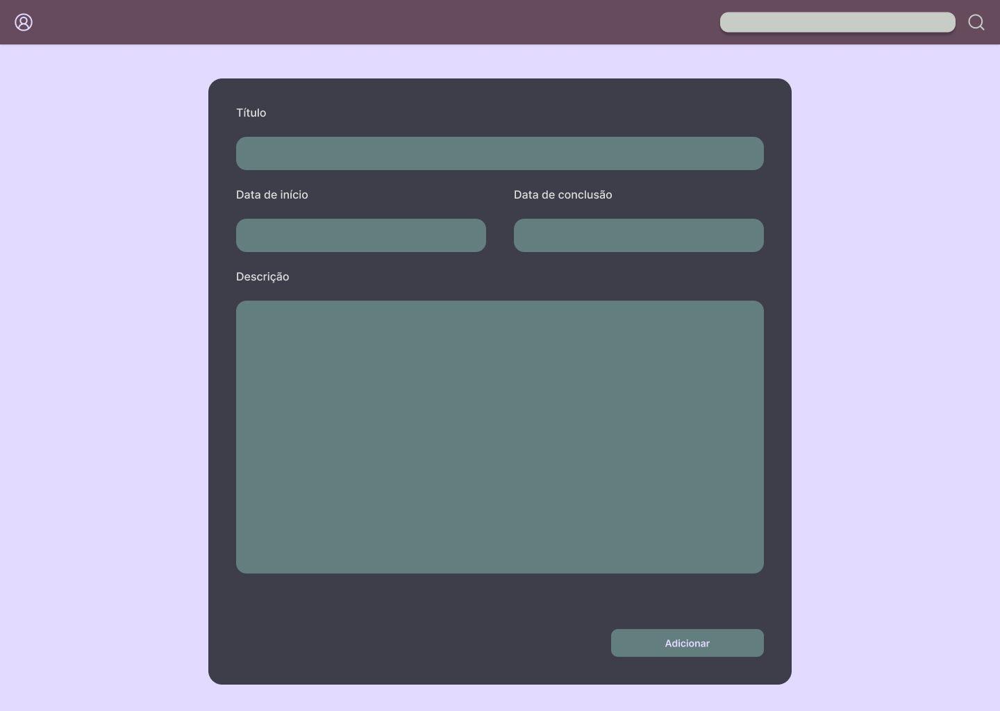<br>
  <sup>Fonte: Material produzido pelos autores, 2025</sup>
  </div>

  Nessa segunda tela há o formulário de criação de evento. Trata-se de um ambiente voltado a administradores. O formulário é composto por campos para inserir o título do evento, as datas de início e de conclusão, além de uma área de texto maior para a descrição. Ao final do formulário, há o botão “Adicionar”, responsável por registrar as informações e disponibilizar o evento no sistema.
  
  <div align="center">
  <sub>FIGURA 12 - Ler Informações do Evento</sub><br>
  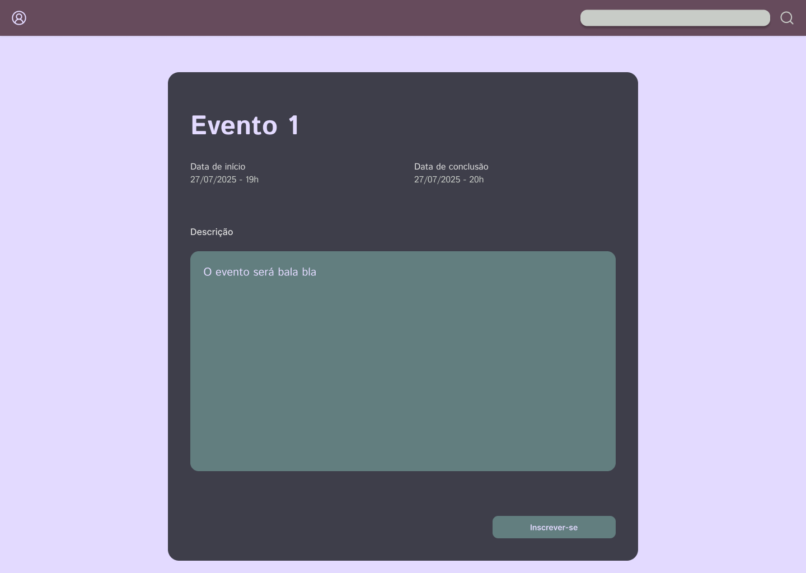<br>
  <sup>Fonte: Material produzido pelos autores, 2025</sup>
  </div>

Por fim, a terceira tela apresenta a listagem de eventos disponíveis. Ela está organizada em duas seções principais: “Novos”, que destaca os eventos mais recentes, e “Todos os eventos”, que exibe uma grade com todos os eventos cadastrados. Cada evento é representado por um cartão simples contendo apenas seu nome. Esses cartões são interativos e levam à tela de visualização do evento quando clicados.

### 3.6. WebAPI e endpoints (Semana 05)

Models

Adm Model (admModel.js)

Este modelo representa a entidade administrador no banco de dados. Ele fornece métodos para interagir com a tabela de administradores.

•
getAll(): Retorna todos os administradores.

•
getById(id): Retorna um administrador pelo seu ID.

•
findByEmail(email): Retorna um administrador pelo seu email.

•
create(data): Cria um novo administrador com os dados fornecidos (nome, email, id_evento).

•
update(id, data): Atualiza um administrador existente pelo seu ID com os novos dados (nome, email, id_evento).

•
delete(id): Exclui um administrador pelo seu ID.

Evento Model (eventoModel.js)

Este modelo representa a entidade evento no banco de dados. Ele gerencia as operações CRUD para eventos e também inclui um método para buscar detalhes relacionados.

•
getAll(): Retorna todos os eventos.

•
getById(id): Retorna um evento pelo seu ID.

•
create(data): Cria um novo evento com os dados fornecidos (data, id_programa, id_adm, id_participante).

•
update(id, data): Atualiza um evento existente pelo seu ID com os novos dados.

•
delete(id): Exclui um evento pelo seu ID.

•
getEventoWithDetails(id): Retorna um evento com detalhes relacionados do administrador, participante e programação, usando JOINs.

Participante Model (participanteModel.js)

Este modelo representa a entidade participante no banco de dados. Ele gerencia as operações CRUD para participantes e permite buscar participantes por evento.

•
getAll(): Retorna todos os participantes.

•
getById(id): Retorna um participante pelo seu ID.

•
create(data): Cria um novo participante com os dados fornecidos (nome, email, cpf, id_evento).

•
update(id, data): Atualiza um participante existente pelo seu ID com os novos dados.

•
delete(id): Exclui um participante pelo seu ID.

•
getByEvento(eventoId): Retorna todos os participantes associados a um evento específico.

Programacao Model (programacaoModel.js)

Este modelo representa a entidade programação no banco de dados. Ele gerencia as operações CRUD para a programação de eventos.

•
getAll(): Retorna todas as programações.

•
getById(id): Retorna uma programação pelo seu ID.

•
create(data): Cria uma nova programação com os dados fornecidos (data, descrição, id_evento).

•
update(id, data): Atualiza uma programação existente pelo seu ID com os novos dados.

•
delete(id): Exclui uma programação pelo seu ID.

•
getByEvento(eventoId): Retorna todas as programações associadas a um evento específico.

Controllers

Adm Controller (admController.js)

Este controlador lida com as requisições relacionadas aos administradores, utilizando o admModel para interagir com o banco de dados.

•
getAllAdms(req, res): Retorna todos os administradores. Responde com status 200 em caso de sucesso ou 500 em caso de erro.

•
getAdmById(req, res): Retorna um administrador específico pelo ID fornecido nos parâmetros da requisição. Responde com status 200 se encontrado, 404 se não encontrado, ou 500 em caso de erro.

•
createAdm(req, res): Cria um novo administrador com os dados fornecidos no corpo da requisição. Responde com status 201 em caso de sucesso ou 500 em caso de erro.

•
updateAdm(req, res): Atualiza um administrador existente pelo ID e dados fornecidos. Responde com status 200 se atualizado, 404 se não encontrado, ou 500 em caso de erro.

•
deleteAdm(req, res): Exclui um administrador pelo ID fornecido. Responde com status 200 se excluído, 404 se não encontrado, ou 500 em caso de erro.

Evento Controller (eventoController.js)

Este controlador lida com as requisições relacionadas aos eventos, utilizando o eventoModel para interagir com o banco de dados.

•
getAllEventos(req, res): Retorna todos os eventos. Responde com status 200 em caso de sucesso ou 500 em caso de erro.

•
getEventoById(req, res): Retorna um evento específico pelo ID fornecido nos parâmetros da requisição. Responde com status 200 se encontrado, 404 se não encontrado, ou 500 em caso de erro.

•
getEventoWithDetails(req, res): Retorna um evento com detalhes relacionados (administrador, participante, programação) pelo ID fornecido. Responde com status 200 se encontrado, 404 se não encontrado, ou 500 em caso de erro.

•
createEvento(req, res): Cria um novo evento com os dados fornecidos no corpo da requisição. Responde com status 201 em caso de sucesso ou 500 em caso de erro.

•
updateEvento(req, res): Atualiza um evento existente pelo ID e dados fornecidos. Responde com status 200 se atualizado, 404 se não encontrado, ou 500 em caso de erro.

•
deleteEvento(req, res): Exclui um evento pelo ID fornecido. Responde com status 200 se excluído, 404 se não encontrado, ou 500 em caso de erro.

Participante Controller (participanteController.js)

Este controlador lida com as requisições relacionadas aos participantes, utilizando o participanteModel para interagir com o banco de dados.

•
getAllParticipantes(req, res): Retorna todos os participantes. Responde com status 200 em caso de sucesso ou 500 em caso de erro.

•
getParticipanteById(req, res): Retorna um participante específico pelo ID fornecido nos parâmetros da requisição. Responde com status 200 se encontrado, 404 se não encontrado, ou 500 em caso de erro.

•
getParticipantesByEvento(req, res): Retorna todos os participantes associados a um evento específico pelo eventoId fornecido nos parâmetros da requisição. Responde com status 200 em caso de sucesso ou 500 em caso de erro.

•
createParticipante(req, res): Cria um novo participante com os dados fornecidos no corpo da requisição. Responde com status 201 em caso de sucesso ou 500 em caso de erro.

•
updateParticipante(req, res): Atualiza um participante existente pelo ID e dados fornecidos. Responde com status 200 se atualizado, 404 se não encontrado, ou 500 em caso de erro.

•
deleteParticipante(req, res): Exclui um participante pelo ID fornecido. Responde com status 200 se excluído, 404 se não encontrado, ou 500 em caso de erro.

Programacao Controller (programacaoController.js)

Este controlador lida com as requisições relacionadas à programação de eventos, utilizando o programacaoModel para interagir com o banco de dados.

•
getAllProgramacoes(req, res): Retorna todas as programações. Responde com status 200 em caso de sucesso ou 500 em caso de erro.

•
getProgramacaoById(req, res): Retorna uma programação específica pelo ID fornecido nos parâmetros da requisição. Responde com status 200 se encontrado, 404 se não encontrado, ou 500 em caso de erro.

•
getProgramacoesByEvento(req, res): Retorna todas as programações associadas a um evento específico pelo eventoId fornecido nos parâmetros da requisição. Responde com status 200 em caso de sucesso ou 500 em caso de erro.

•
createProgramacao(req, res): Cria uma nova programação com os dados fornecidos no corpo da requisição. Responde com status 201 em caso de sucesso ou 500 em caso de erro.

•
updateProgramacao(req, res): Atualiza uma programação existente pelo ID e dados fornecidos. Responde com status 200 se atualizado, 404 se não encontrado, ou 500 em caso de erro.

•
deleteProgramacao(req, res): Exclui uma programação pelo ID fornecido. Responde com status 200 se excluído, 404 se não encontrado, ou 500 em caso de erro.

Auth Controller (authController.js)

Este controlador lida com a autenticação de usuários. Embora o código não tenha sido lido diretamente, a presença de authRoutes.js e a convenção de nomenclatura sugerem que ele gerencia o login.

•
login(req, res): Lida com a autenticação de usuários, provavelmente verificando credenciais e retornando um token de autenticação.

Endpoints

Endpoints de Administrador (/api/adm)

•
GET /api/adm/:id: Retorna um administrador específico pelo ID.

•
POST /api/adm: Cria um novo administrador.

•
PUT /api/adm/:id: Atualiza um administrador existente pelo ID.

•
DELETE /api/adm/:id: Exclui um administrador pelo ID.

Endpoints de Evento (/api/evento)

•
GET /api/evento/:id: Retorna um evento específico pelo ID.

•
POST /api/evento: Cria um novo evento.

•
PUT /api/evento/:id: Atualiza um evento existente pelo ID.

•
DELETE /api/evento/:id: Exclui um evento pelo ID.

Endpoints de Participante (/api/participante)

•
GET /api/participante: Retorna todos os participantes.

•
GET /api/participante/:id: Retorna um participante específico pelo ID.

•
POST /api/participante: Cria um novo participante.

•
PUT /api/participante/:id: Atualiza um participante existente pelo ID.

•
DELETE /api/participante/:id: Exclui um participante pelo ID.

Endpoints de Programação (/api/programacao)

•
GET /api/programacao: Retorna todas as programações.

•
GET /api/programacao/:id: Retorna uma programação específica pelo ID.

•
GET /api/programacao/evento/:eventoId: Retorna todas as programações associadas a um evento específico.

•
POST /api/programacao: Cria uma nova programação.

•
PUT /api/programacao/:id: Atualiza uma programação existente pelo ID.

•
DELETE /api/programacao/:id: Exclui uma programação pelo ID.


### 3.7 Interface e Navegação (Semana 07)

*Descreva e ilustre aqui o desenvolvimento do frontend do sistema web, explicando brevemente o que foi entregue em termos de código e sistema. Utilize prints de tela para ilustrar.*

---

## <a name="c4"></a>4. Desenvolvimento da Aplicação Web (Semana 8)

### 4.1 Demonstração do Sistema Web (Semana 8)

*VIDEO: Insira o link do vídeo demonstrativo nesta seção*
*Descreva e ilustre aqui o desenvolvimento do sistema web completo, explicando brevemente o que foi entregue em termos de código e sistema. Utilize prints de tela para ilustrar.*

### 4.2 Conclusões e Trabalhos Futuros (Semana 8)

*Indique pontos fortes e pontos a melhorar de maneira geral.*
*Relacione também quaisquer outras ideias que você tenha para melhorias futuras.*


## <a name="c5"></a>5. Referências

_Incluir as principais referências de seu projeto, para que seu parceiro possa consultar caso ele se interessar em aprofundar. Um exemplo de referência de livro e de site:_<br>

---
---
