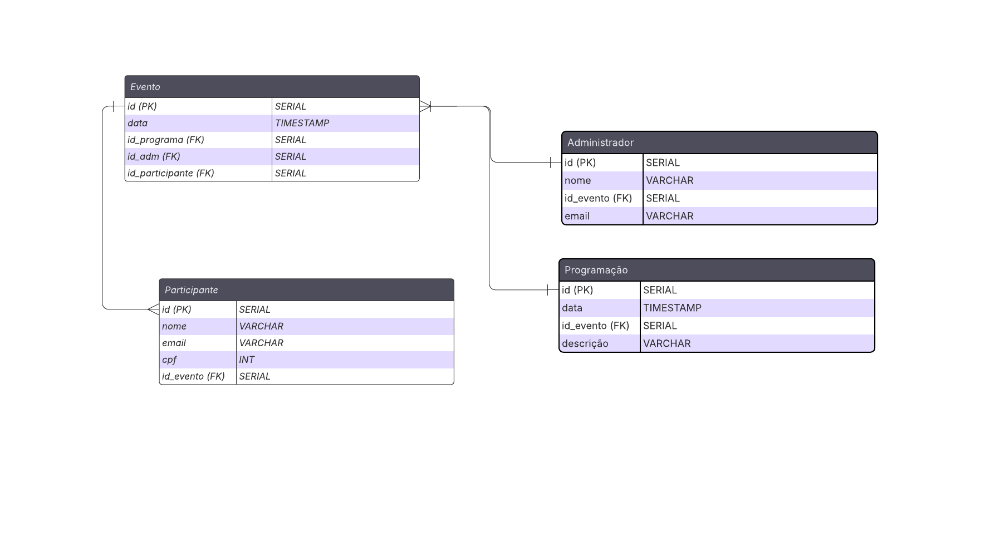

# Web Application Document - Projeto Individual - Módulo 2 - Inteli

## Nome do Projeto

#### Autor do projeto

## Sumário

1. [Introdução](#c1)  
2. [Visão Geral da Aplicação Web](#c2)  
3. [Projeto Técnico da Aplicação Web](#c3)  
4. [Desenvolvimento da Aplicação Web](#c4)  
5. [Referências](#c5)  

<br>

## <a name="c1"></a>1. Introdução (Semana 01)

Esse sistema será uma plataforma para a criação de eventos de forma a simplificar a organização e gestão deles, oferecendo soluções completas para o gerenciamento de inscrições e divulgação da programação do evento. Com um sistema intuitivo, os organizadores podem gerenciar facilmente desde a criação do evento até o acompanhamento de participantes.


## <a name="c2"></a>2. Visão Geral da Aplicação Web

### 2.1. Personas (Semana 01)

<div align="center">
  <sub>FIGURA 1 - Amélia</sub><br>
  <br>
  <sup>Fonte: Material produzido pelos autores, 2025</sup>
  </div>

### 2.2. User Stories (Semana 01)

\# | Story | I | N | V | E | S | T |
---| --- | --- | --- | --- | --- | --- | --- 
US01 | Como organizador de eventos, quero ter um controle centralizado das informações dos participantes, para que eu possa acompanhar confirmações, gerenciar mudanças de forma simples. | O controle centralizado das informações dos participantes pode ser desenvolvido e implementado sem depender de outras funcionalidades. Pode ser priorizada e entregue de forma autônoma. | A user story é negociável, pois a maneira de implementar o controle centralizado das informações pode ser discutida. Os detalhes de como o gerenciamento das confirmações e mudanças será feito podem ser ajustados com base nas necessidades do time ou do cliente. | A funcionalidade é valiosa para o organizador de eventos, pois facilita o processo de monitoramento e gestão das confirmações de participação e alterações nas informações dos participantes, ajudando a otimizar o fluxo de trabalho e garantir que o organizador tenha visibilidade total e controle sobre as informações de forma eficiente.| O escopo pode ser estimado considerando a quantidade de participantes, tipos de informações que precisam ser controladas e os requisitos técnicos para a implementação do controle centralizado. | Essa user story é pequena o suficiente para ser concluída dentro de um ciclo de desenvolvimento de uma sprint. | A user story é testável, pois podemos definir critérios de aceitação claros para garantir que a funcionalidade atenda aos requisitos. A validação pode ser feita por testes manuais ou automatizados para garantir que as mudanças e confirmações sejam gerenciadas de forma eficaz. 
US02 | Como participante, posso efetuar a inscrição no evento para consumir conteúdo.  | 
US03 | Como UX designer, eu quero fazer uma interface intuitiva para facilitar a navegabilidade do usuário. | 

---

## <a name="c3"></a>3. Projeto da Aplicação Web

### 3.1. Modelagem do banco de dados  (Semana 3)

<div align="center">
  <sub>FIGURA 2 - Modelo Lógico</sub><br>
  <br>
  <sup>Fonte: Material produzido pelos autores, 2025</sup>
  </div>

*Modelo Físico*

```
CREATE TABLE IF NOT EXISTS evento (
id SERIAL PRIMARY KEY,
evento VARCHAR(150),
endereço VARCHAR(300),
data TIMESTAMP,
FOREIGN KEY (id_programa) REFERENCES programação(id),
FOREIGN KEY (id_adm) REFERENCES administrador(id),
FOREIGN KEY (id_participante) REFERENCES participante(id)
);
CREATE TABLE IF NOT EXISTS administrador(
id SERIAL PRIMARY KEY,
nome VARCHAR(100),
FOREIGN KEY (id_evento) REFERENCES evento(id),
email VARCHAR(300)
);
CREATE TABLE IF NOT EXISTS participante (
id SERIAL PRIMARY KEY,
nome VARCHAR(100),
email VARCHAR(300),
cpf INT,
FOREIGN KEY (id_evento) REFERENCES evento(id)
);
CREATE TABLE IF NOT EXISTS programação (
id SERIAL PRIMARY KEY,
data TIMESTAMP,
descrição VARCHAR(500),
FOREIGN KEY (id_evento) REFERENCES evento(id)
);

```
[Schema](../assets/bd.sql)

*Posicione também o modelo físico com o Schema do BD (arquivo .sql)*

### 3.1.1 BD e Models (Semana 5)
*Descreva aqui os Models implementados no sistema web*

### 3.2. Arquitetura (Semana 5)

*Posicione aqui o diagrama de arquitetura da sua solução de aplicação web. Atualize sempre que necessário.*

**Instruções para criação do diagrama de arquitetura**  
- **Model**: A camada que lida com a lógica de negócios e interage com o banco de dados.
- **View**: A camada responsável pela interface de usuário.
- **Controller**: A camada que recebe as requisições, processa as ações e atualiza o modelo e a visualização.
  
*Adicione as setas e explicações sobre como os dados fluem entre o Model, Controller e View.*

### 3.3. Wireframes (Semana 03)

*Posicione aqui as imagens do wireframe construído para sua solução e, opcionalmente, o link para acesso (mantenha o link sempre público para visualização).*

### 3.4. Guia de estilos (Semana 05)

*Descreva aqui orientações gerais para o leitor sobre como utilizar os componentes do guia de estilos de sua solução.*


### 3.5. Protótipo de alta fidelidade (Semana 05)

*Posicione aqui algumas imagens demonstrativas de seu protótipo de alta fidelidade e o link para acesso ao protótipo completo (mantenha o link sempre público para visualização).*

### 3.6. WebAPI e endpoints (Semana 05)

*Utilize um link para outra página de documentação contendo a descrição completa de cada endpoint. Ou descreva aqui cada endpoint criado para seu sistema.*  

### 3.7 Interface e Navegação (Semana 07)

*Descreva e ilustre aqui o desenvolvimento do frontend do sistema web, explicando brevemente o que foi entregue em termos de código e sistema. Utilize prints de tela para ilustrar.*

---

## <a name="c4"></a>4. Desenvolvimento da Aplicação Web (Semana 8)

### 4.1 Demonstração do Sistema Web (Semana 8)

*VIDEO: Insira o link do vídeo demonstrativo nesta seção*
*Descreva e ilustre aqui o desenvolvimento do sistema web completo, explicando brevemente o que foi entregue em termos de código e sistema. Utilize prints de tela para ilustrar.*

### 4.2 Conclusões e Trabalhos Futuros (Semana 8)

*Indique pontos fortes e pontos a melhorar de maneira geral.*
*Relacione também quaisquer outras ideias que você tenha para melhorias futuras.*


## <a name="c5"></a>5. Referências

_Incluir as principais referências de seu projeto, para que seu parceiro possa consultar caso ele se interessar em aprofundar. Um exemplo de referência de livro e de site:_<br>

---
---
